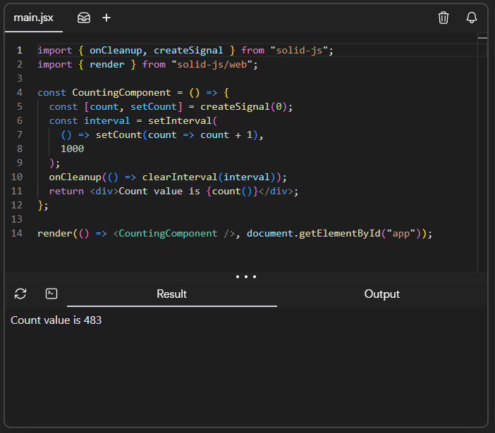

# 7 Frameworks Frontend para aprender em 2025 e conseguir um emprego 🚀
O desenvolvimento Web em 2025 está avançando a uma velocidade vertiginosa, impulsionado por inovações revolucionárias em estruturas, ferramentas e metodologias. Os desenvolvedores estão testemunhando uma mudança transformadora na forma como os aplicativos modernos são criados, com desempenho, escalabilidade e experiência do usuário em primeiro lugar.

O ano mal começou e nós já estamos presenciando um avanço inacreditável das tecnologias Frontend. A forma como desenvolvemos sistemas web e aplicativos modernos está mudando completamente, e dessa vez, as ferramentas já estão sendo construídas pensando no desenvolvedor. As novas tecnologias são bem menos verbosas que as tradicionais, e o desempenho é inacreditavelmente melhor.

Mas nesse mar de tecnologias sendo lançadas, qual escolher para me destacar no mercado?

Neste artigo eu trago 7 frameworks para ficar ligados em 2025 na área de desenvolvimento web e que podem te dar um EMPREGO.

# Os Frameworks

O [roadmap.sh](https://roadmap.sh), um site que dá instruções de boas práticas de código em todas as áreas de desenvolvimento, mantido em um projeto *open source* no *GitHub* e constantemente atualizado pela comunidade, lançou no começo do ano um artigo sobre o **top 7 frameworks de desenvolvimento *frontend*** baseado em alguns critérios.

Esses critérios são:

- **Desempenho:** O framework lida bem com cenários do mundo real, incluindo tempos de carregamento de página, velocidade de renderização e uso eficiente de recursos?
- **Popularidade e suporte da comunidade:** Existe uma grande comunidade em torno do framework? É fácil encontrar tutoriais, fóruns e ferramentas de terceiros?
- **Curva de aprendizado:** A estrutura é fácil de aprender para novos desenvolvedores ou requer um domínio complexo de padrões e paradigmas?
- **Ecossistema e extensibilidade:** A estrutura oferece um ecossistema robusto de bibliotecas, plug-ins e ferramentas para estender sua funcionalidade?
- **Escalabilidade e flexibilidade:** A estrutura pode lidar com projetos pequenos e grandes? É flexível o suficiente para suportar diferentes tipos de projetos, desde aplicativos de página única (SPAs) até soluções empresariais complexas?
- **Preparada para o futuro:** A estrutura é ativamente mantida e está em evolução? Permanecerá relevante nos próximos anos, com base nas tendências?

Então cada um dos frameworks citados ganha uma nota para cada um desses critérios, que no fim é calculado em um score total.

É difícil dizer qual é o melhor framework sem saber o seu objetivo final, o contexto e as características do projeto e até da equipe. 

Mas o objetivo dessa lista é ranquear os frameworks pelo o que eles oferecem, e consequentemente, os frameworks com score mais alto vão ser aqueles mais amplamente utilizados em 2025, o que aumenta sua chance de conseguir um emprego se você dominar algum deles.

Sem mais delongas, vamos lá.

# Os 7 Frameworks JavaScript Mais Populares de 2025 📈
### 7️⃣ **Qwik**

Começando com o [Qwik](https://qwik.dev), um framework emergente que tem como foco a performance. Ele utiliza uma abordagem inovadora chamada *resumable*, onde só carrega o necessário para a renderização da página, resultando em tempos de carregamento praticamente instantâneos. ⏱️

No site do Qwik, ele explica que esse conceito de *resumability* pula o processo de *Hydration*. Vou explicar.

A principal prioridade do navegador quando abrimos uma página da web é carregar o HTML e o CSS puramente. Em seguida, o JavaScript é carregado e os eventos do JavaScript são acoplados ao HTML, o que torna a página dinâmica e interativa.

No Qwik ele propõe pular essa parte, e só carregar o JavaScript à medida que o usuário interage com a página. Isso dá então um ganho de desempenho na primeira renderização da página.

Muito promissor para sites que priorizam performance.

- **Performance:** 5/5 – Carregamento ultra rápido!
- **Popularidade:** 3/5 – Ainda está crescendo, mas tem um grande potencial.
- **Curva de Aprendizado:** 3.5/5 – Uma abordagem nova, então pode ser um pouco difícil no começo.
- **Escalabilidade:** 4.5/5 – Perfeito para aplicações grandes.
- **Futuro:** 4/5 – Promissor para sites que priorizam performance.

---

### 6️⃣ **Solid.js**

Em sexto lugar, temos o [Solid.js](https://solidjs.com). Lançado em 2018, se destaca pela sua extrema rapidez. Ele não utiliza um DOM virtual, mas sim o conceito de *reatividade refinada*, o que faz com que ele seja super rápido nas atualizações da interface. ⚡

Na minha opinião, quando se fala de desempenho em aplicações complexas, o Solid.js é hoje a melhor solução disponível no mercado. Os testes de benchmark estão sempre apontando o Solid.js como mais performático em questão de rapidez na renderização da página.

Fora isso ele tem uma sintaxe bastante familiar, muito parecida com a do React.

*Sintaxe do Solid.js*

- **Performance:** 5/5 – Extremamente rápido para aplicações que têm gerenciamento de estado complexo.
- **Popularidade:** 3.5/5 – A comunidade ainda é pequena, mas está crescendo.
- **Curva de Aprendizado:** 3.5/5 – O sistema de reatividade fina leva algum tempo para ser totalmente entendido.
- **Escalabilidade:** 4/5 – Excelente para aplicações mais complexas.
- **Futuro:** 4/5 – Está ganhando cada vez mais destaque.

---

### 5️⃣ **Svelte**

Em quinto lugar, temos o [Svelte](https://svelte.dev), um framework que não utiliza o DOM virtual, mas sim compila o código em tempo de construção. Isso faz com que as aplicações criadas com Svelte sejam super rápidas e leves. ⚙️

Diferente dos dois frameworks anteriores mostrados nesse artigo, o Svelte já tem uma participação sólida no mercado e já é utilizado por grandes empresas como a **Apple**, **Spotify** e até o nosso **Stack Overflow**.

O diferencial do Svelte é ter uma sintaxe fácil. Muito fácil. No site do Svelte tem um tutorial onde ele mostra os básicos de como usar esse framework. E com poucas linhas de código é possível criar elementos funcionais de complexidade simples ou média.

- **Performance:** 5/5 – Código otimizado e rápido!
- **Popularidade:** 4/5 – Comunidade crescente e ativa.
- **Curva de Aprendizado:** 4.5/5 – Sintaxe fácil e intuitiva.
- **Escalabilidade:** 4/5 – Ideal para projetos de médio porte.
- **Futuro:** 4.5/5 – Um dos frameworks mais promissores no momento.

---

### 4️⃣ **Astro**

Em quarto lugar, temos o [Astro](https://astro.build), um framework incrível para a construção de sites estáticos rápidos. Ele permite que você use diferentes frameworks dentro de um mesmo projeto, mas carrega apenas o essencial, o que melhora ainda mais a performance. 🌐

Assim como o Svelte, o Astro também já é amplamente utilizado na construção de sites estáticos por várias empresas grandes, como a Google, Microsoft e a Porsche (sim, a fabricante de carros).

O Astro utiliza o conceito de *Server-First.* Os componentes são renderizados no servidor e então é enviado um HTML leve e comprimido para o navegador, o que dá um incrível ganho de performance na renderização do site.

Outro conceito interessante do Astro é o de Flexibilidade Máxima. Você pode utilizar componentes escritos com outros frameworks dentro do Astro. Dessa forma você reaproveita o seu código e economiza bastante tempo na criação de uma aplicação nova. O Astro já é compatível com React, Vue, Svelte e o Solid.js. 

- **Performance:** 5/5 – Ideal para sites estáticos super rápidos.
- **Popularidade:** 4/5 – Está crescendo rapidamente, especialmente para sites de conteúdo.
- **Curva de Aprendizado:** 5/5 – Super fácil de aprender, principalmente se você já conhece React ou Vue.
- **Escalabilidade:** 3.5/5 – Ideal para sites estáticos, mas ainda está amadurecendo para apps mais dinâmicos.
- **Futuro:** 4.5/5 – O futuro do Astro é muito promissor, principalmente para sites rápidos e leves.

---

### 3️⃣ **Angular**

Entrando no Top 3, temos o [Angular](https://angular.dev), um framework robusto da Google. Ele é a escolha certa para projetos grandes, pois oferece muitos recursos prontos para uso, como injeção de dependência, roteamento e muito mais. 🏗️ Esse é pessoalmente, o meu favorito. É a tecnologia que sou especialista e que utilizo no meu dia a dia do trabalho. 

Por ser desenvolvido pela Google, o Angular tem grande popularidade e suporte. A melhor opção no mercado para a construção de aplicações empresariais, que costumam se tornar grandes e complexas em termos de lógica e quantidade de componentes. Utilizando boas práticas de código, é possível fazer essas aplicações complexas terem uma performance incrível utilizando o Angular, o que deixa o Angular sempre entre os melhores benchmarks quando se trata de Frameworks JavaScript. O Angular 2 — que é como chamamos a versão do Angular lançada após o Angular.js — foi lançado em 2016 e a popularidade e comunidade cresce até hoje, o que nos faz acreditar que o Angular ainda vai continuar no Top Frameworks baseados em JavaScript por muitos anos.

- **Performance:** 4/5 – Pode ser mais pesado em grandes aplicações se não for otimizado corretamente.
- **Popularidade:** 4.5/5 – Grande comunidade e suporte corporativo.
- **Curva de Aprendizado:** 3/5 – Pode ser mais desafiador devido à sua complexidade.
- **Escalabilidade:** 5/5 – Perfeito para grandes aplicações.
- **Futuro:** 5/5 – O Angular continua sendo uma escolha sólida para empresas.

---

### 2️⃣ **React**

Em segundo lugar, temos o [React](https://react.dev). Uma curiosidade sobre o React é que ele não é um Framework, e sim uma **biblioteca.** Para ter todas as funcionalidades para a construção de uma página como data fetching e roteamento**,** é necessário usar **** um framework React como o **Next.js** ou **Remix.** 

React é uma das tecnologias mais populares e amplamente utilizadas. Criado pelo Facebook, o React é conhecido pela sua flexibilidade e pela grande quantidade de bibliotecas e ferramentas que o acompanham. 💡

O React apostou no conceito de componentização e reusabilidade da código, que deu muito certo e tornou o React tão popular.

Também introduziu o conceito de Hooks, e Gerenciamento de Estado, que virou um padrão e é utilizado por vários outros frameworks. Por utilizar conceitos diferentes, o React pode ser um pouco difícil de aprender no começo. Mas uma vez que você tem a prática, se torna mais simples.

A maioria dos sites que você utiliza no dia a dia, como Instagram, WhatsApp e o próprio Facebook, são desenvolvidos com React.

É com certeza a tecnologia mais sólida disponível no mercado.

- **Performance:** 4/5 – Boa performance, mas requer otimizações em grandes apps.
- **Popularidade:** 5/5 – A maior comunidade de desenvolvedores.
- **Curva de Aprendizado:** 3.5/5 – Aprender JSX e Hooks pode ser um pouco desafiador no começo.
- **Escalabilidade:** 4.5/5 – Funciona muito bem em projetos de qualquer escala.
- **Futuro:** 5/5 – O React tem um futuro brilhante pela frente.

---

### 1️⃣ **Vue.js**

E em primeiro lugar, temos o **Vue.js**, o framework mais popular e amado pela comunidade de desenvolvedores. Sua facilidade de uso, excelente performance e uma comunidade engajada fazem do Vue a escolha número 1 para muitos projetos frontend. 🌟

O mais interessante do Vue.js é que ele foi desenvolvido por um único desenvolvedor, o Evan You. E hoje o framework é mantido por ele e por uma equipe dedicada.

O Vue.js acabou se tornando uma opção melhor que o React se tratando de programação reativa e performance.

Os componentes do Vue.js são escritos utilizando HTML, CSS e JavaScript puros. O que torna a curva de aprendizado muito baixa, caso você venha do básico e está aprendendo seu primeiro Framework.

- **Performance:** 4.5/5 – Rápido e eficiente, com um sistema de reatividade incrível.
- **Popularidade:** 5/5 – Uma comunidade super ativa e um vasto ecossistema.
- **Curva de Aprendizado:** 4.5/5 – Fácil de aprender, com uma sintaxe simples e direta.
- **Escalabilidade:** 4.5/5 – Perfeito para qualquer tipo de projeto.
- **Futuro:** 4.5/5 – O Vue continua a crescer e tem um futuro brilhante!

## Considerações Finais

A pontuação final ficou assim:

- **Vue.js**: **27**
- **React**: **26**
- **Angular**: **26**
- **Svelte**: **25**
- **Astro**: **25.5**
- **Solid.js**: **24**
- **Qwik**: **23**

Significa que o nosso grande vencedor foi o Vue.js 🏆, certo? …Não.

No começo desse artigo eu deixei claro que o objetivo final seria ranquear os frameworks pela probabilidade que eles têm de te fazer conseguir um emprego, e essa tabela, apesar de apontar o melhor framework com base em todos os quesitos, ela não leva em consideração a empregabilidade de cada um.

*Pesquisa do Stack Overflow, respondida por 48,503 desenvolvedores no mundo todo, em julho de 2024.*

Essa pesquisa do Stack Overflow realizada com 48,503 desenvolvedores no mundo todo, em julho de 2024, mostra que **39.5% dos programadores profissionais trabalham com React**, isto é, em relação a TODOS os frameworks existentes de todas as áreas da programação, não só frontend. Isso mostra que o mercado ainda está voltado massivamente para desenvolvedores **React**, embora muitas tecnologias promissoras estejam surgindo, todas ainda se encontram em um estágio inicial em relação ao suporte da comunidade e ecossistema.

*Número de perguntas sobre cada framework, no Stack Overflow, por ano.*

Esse outro gráfico, mostra que até 2024, no Stack Overflow, o framework com mais questões criadas na plataforma é o React. Apesar de alguns frameworks como Angular e o Vue.js terem apresentado uma leve subida e o React ter apresentado uma queda brusca, ele ainda é **indiscutivelmente o framework mais popular e mais amplamente utilizado.**

Além disso, todos os frameworks mais recentes que apresentamos nessa lista, têm a sintaxe muito próxima ou idêntica à do React. Portanto, se você quiser migrar para outro framework você já vai ter mais facilidade por estar familiarizado.

Logo, para você que quer conseguir um emprego como desenvolvedor Frontend em 2025, o seu grande amigo é o **React**, e portanto, **o grande vencedor dessa lista**.

### Qual desses frameworks você já usou ou pretende usar? 🤔

Deixe sua opinião nos comentários! Não se esqueça de compartilhar este post com os amigos e ficar de olho para mais conteúdos sobre desenvolvimento frontend. Até a próxima! 👋

Fontes:
- [https://www.statista.com/statistics/1124699/worldwide-developer-survey-most-used-frameworks-web/](https://www.statista.com/statistics/1124699/worldwide-developer-survey-most-used-frameworks-web/)
- [https://dev.to/codewithshahan/the-future-of-frontend-developer-2025-54me](https://dev.to/codewithshahan/the-future-of-frontend-developer-2025-54me)
- [https://roadmap.sh/frontend/frameworks](https://roadmap.sh/frontend/frameworks)
- [https://survey.stackoverflow.co/2024/technology#1-web-frameworks-and-technologies](https://survey.stackoverflow.co/2024/technology#1-web-frameworks-and-technologies)