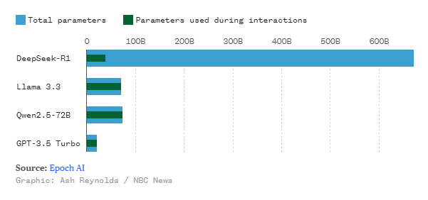

# O que é o DeepSeek e como o ChatGPT “perdeu o emprego”

Na ultima semana uma noticia abalou o mercado mundial:

Uma empresa de inteligência artificial muito pouco conhecida da china lançou uma série de LLM’s (Large Language Model) — modelos de deep learning treinados com uma quantidade massiva de dados — que superam a maioria dos modelos das grandes empresas de IA.

## A nova concorrente do ramo

A DeepSeek lançou o seu poderoso modelo, R1, em 20 de janeiro, e esse virou o assistente de IA numero 1 na appStore, tirando o ChatGPT do trono.

Essa noticia por si só não é tão chocante, MAS, um detalhe mudou tudo.

A empresa também revelou que o valor usado para desenvolvimento dos modelos foi de apenas 6 milhões de dólares. Para se ter uma referencia, em apenas uma das rodadas de investimentos de 2024, a OpenAI arrecadou um investimento histórico de 6,6 bilhões de dólares. É, literalmente, mil vezes maior.

Não para por ai.

Os modelos demonstraram a habilidade de superar os modelos mais tops do mercado em vários testes de benchmark.

O até então modelo mais popular, o GPT 4o, foi posto contra a parede, sendo questionado da sua eficiência e dos seus custos de operação.

A empresa chinesa mostrou que os desenvolvedores não precisam de valores exorbitantes de dinheiro para obter um resultado espetacular em termos de treinamento de modelos.

## Contra os dados, não há argumentos

ESPETACULAR não é exagero.

*Total de parâmetros do R1 comparado aos concorrentes.*

Esse gráfico mostra que apesar de ser uma IA consideravelmente maior que as mais populares, apenas uma fração dos parâmetros são usados em cada interação.

Isso porque a DeepSeek apostou em uma arquitetura de modelos “experts”, onde o LLM é dividido em inúmeros submodelos especialistas, cada um especializado em uma tarefa especifica ou em dados específicos. Cada submodelo só é ativado quando o seu conhecimento é necessário para aquela interação. Isso diminui drasticamente a quantidade de recursos usados em cada interação e consequentemente, o custo de operação.

A empresa também garante que desenvolveu uma estratégia para que cada “especialista” não fique sobrecarregado ou subcarregado, fazendo ajustes dinâmicos além do tradicional *penalty-based* que pode piorar a performance do modelo. 

## Quanto custou?

Ser mais barato e mais rápido de treinar torna os modelos da DeepSeek os melhores até o momento.

A empresa revelou que o V3 — Modelo que serviu de base para o poderoso R1 — custou 6 milhões de dólares e apenas 2 meses para ser desenvolvido. 

*Valor investido no treinamento do V3, em relação ao concorrente GPT-4.*

Além disso, devido as limitações de exportações da Nvidia, em face do governo americano, a empresa chinesa foi obrigada a treinar seus modelos com o chip H800, diferente da OpenAI que usa os mais avançados e mais poderosos H100.

## Quão melhor?

*Resultado dos testes de benchmark envolvendo o R1, o1, Qwen 2.5, Llama 3.1 e Claude 3.5.*

Esse gráfico mostra que a DeepSeek ultrapassa as melhores IA’s do momento (OpenAI o1,  Anthropic Claude 3.5 Sonnet, Meta Llama 3.1 405B, Alibaba Qwen 2.5 72B) em testes de benchmark. Nos benchmarks de conhecimento geral e discussão científica, o o1 da OpenAI levou a melhor.

Uma das features do R1 é explicar sua trilha de pensamento, quebrando explicações complexas em passos menores, o que imita o pensamento humano.

Qual serão os próximos passos das empresas? Qual será o posicionamento e estratégia das empresas de IA para não serem engolidas pela gigante chinesa?

Qualquer que seja a resposta, o certo é que a medida que os modelos ficam mais eficientes, a forma como lidamos com problemas da vida real vai mudar completamente, impactando todas as áreas de atuação do ser humano. A programação está inclusa.

Fontes:

- https://www.nbcnews.com/data-graphics/deepseek-ai-comparison-openai-chatgpt-google-gemini-meta-llama-rcna189568